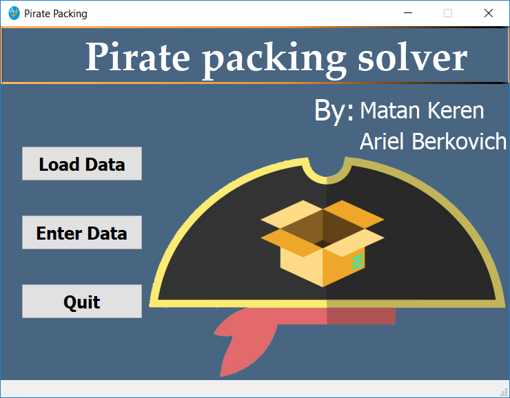
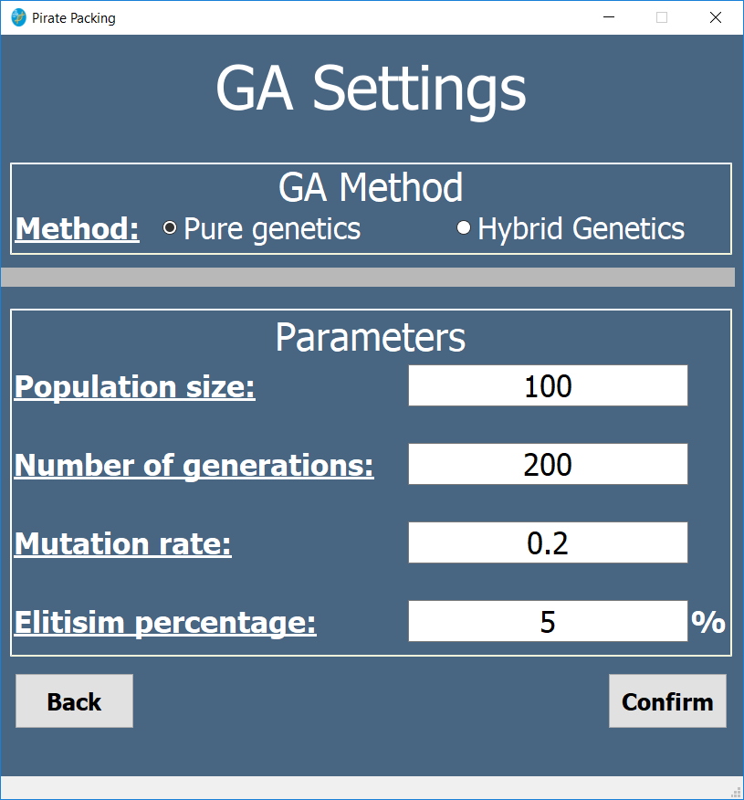

# Pirate_Packing
  
## Project Description
The aim of this project is to solve the 3D Knapsack-Bin(referred as “pirate packing”) packing problem using genetic algorithms and to explore the best encoding (chromosome) for the problem solution and the various genetic parameters (crossover, mutation and generations). This project will compare two methods to solve this problem, one which is purely a genetic algorithm using a binary string and the second is a genetic algorithm with DBLF (Deepest Bottom Left Fill) heuristic, where the genetic algorithm will find the best insert permutation. We will compare which method gives the best solutions and which method converge to a solution faster.

## Screenshots

## Building Dependencies
* Cmake(at least 3.0) and a C++11 or better compiler  
* Qt 5 SDK
* boost library
  
## Credits
* Ariel Berkovich  
* Matan Keren  
